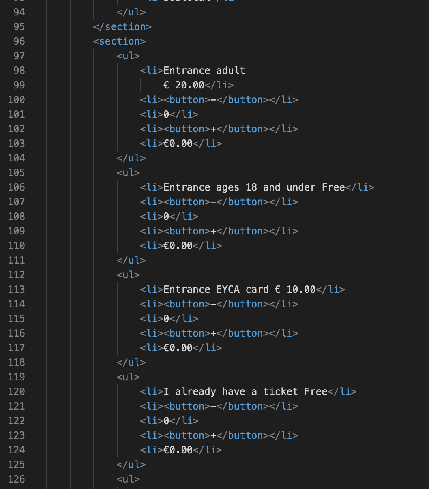

# Procesverslag
Markdown is een simpele manier om HTML te schrijven.  
Markdown cheat cheet: [Hulp bij het schrijven van Markdown](https://github.com/adam-p/markdown-here/wiki/Markdown-Cheatsheet).

Nb. De standaardstructuur en de spartaanse opmaak van de README.md zijn helemaal prima. Het gaat om de inhoud van je procesverslag. Besteedt de tijd voor pracht en praal aan je website.

Nb. Door *open* toe te voegen aan een *details* element kun je deze standaard open zetten. Fijn om dat steeds voor de relevante stuk(ken) te doen.

## Jij

uitwerken voor kick-off werkgroep

### Auteur:
Eva van Bakel

#### Je startniveau:
blauw

#### Je focus:
surface plane

## Je website

uitwerken voor kick-off werkgroep

### Je opdracht:
https://www.rijksmuseum.nl/en

#### Screenshot(s) van de eerste pagina (small screen): 
home pagina  

#### Screenshot(s) van de tweede pagina (small screen):
tickets pagina 

 

## Breakdownschets (week 1)

uitwerken na afloop 2e werkgroep

Voor de breakdownschetsen heb ik een gedeelte van de footer weggehouden en verder de gehele voorpagina gebruikt. Dit moet ik eerst goed uitwerken voordat ik verder kan.
De site bestaat uit gehele afbeeldingen waar op geklikt kan worden, hierbij zitten er kleine stukjes tekst met meer informatie erover. Verder staat onderin de footer sponsoren en linkjes die daarbij horen. 

Het lastige is voor de tweede pagina het tabel dat erin hoort, ik weet niet heel goed hoe ik dat ga doen maar daar kom ik nog wel achter. 
### de hele pagina: 

## Voortgang 1 (week 2)

uitwerken voor 1e voortgang

### Stand van zaken
Toen we op school waren wilde ik het probleem fixen waar ik mee zat:
Het plaatsen van de images; tussen elk plaatje kwam er een witte regel te staan,  na hulp te vragen heb ik dit anders kunnen oplossen door de sections een background te geven inplaats van images in de sections te plaatsen. Ook wist ik niet of een site zonder H1 toegestaan was maar na fb kwam ik erachter dat dit mocht zodat ik de logo er gewoon in kan plaatsen. 

Ik had eerst om hulp gevraagd aan klasgenootjes die bij mij aan de tafel zaten en vervolgens nog andere groepjes , maar die wisten er ook niet bepaald veel van waarom het streepje er zat. Uiteindelijk ben ik toch naar de docent gestapt waarna mijn probleem wel snel opgelost was. 

Ik kreeg als feedback te horen juist classes te gebruiken bij de bg van de sections. 

PS: dit heb ik vervolgens weggewerkt aangezien dit weggewerkt kon worden met nth-of-type. Het stond er anders dubbel in en dat was niet nodig. 

### Verslag van meeting
hier na afloop snel de uitkomsten van de meeting vastleggen

- Als feedback kreeg ik te horen dat ik meer aan het vak moest werken. 

## Voortgang 2 (week 3)

uitwerken voor 2e voortgang

### Stand van zaken
Door HCI had ik niet al te veel kunnen doen. Ik heb hier uiteindelijk toch 
aan kunnen werken. Ik ben hierna begonnen met mijn tweede pagina, hier heb ik een start aan gemaakt: tekst dat erin hoort etc. is al gedaan. 

Mijn eerste pagina had ik voornamelijk al, behalve de footer wat ik later toegevoegd heb. Ik had dit zelf als niet perse functionele gedeelte gemarkeerd maar dit kon er opzich ook wel bij.

PS: ik heb HCI  gehaald trouwens :)
### Verslag van meeting
hier na afloop snel de uitkomsten van de meeting vastleggen

Bij het gesprek met de studentenassistent kwam ik op het volgende:

- inplaats van buttons in de navigatie te gebruiken er li's van te maken.
- de FREE ENTRY geen p te geven maar een strong van maken
- met grid misschien het tabel te maken.
- opschonen van HTML; classes wegwerken

## Toegankelijkheidstest (week 4)

uitwerken na test in 8e voortgang

#### Beperkingen
Doormiddel met een shockapparaat kon je kijken hoe mensen met parkinson functioneren op onze sites. Ik merkte bij andere dat het gebruik van de muis lastig was.

Daarom is het toegankelijk maken van de site met toetsen een oplossen. Hiermee hoeft er alleen op een toets gedrukt te worden en kan de gebruiker gemakkelijk door de site heen. 

Met een ballon moesten we proberen nog gefocused te blijven en hiermee toch nog door te gaan. Dit klonk makkelijker dan gedaan. 

Met de brillen konden we zien hoe eht was voor mensen om: 
- wazig te zien
- kleurenblind te zijn (gele tinten kunnen zien)
- geblurd/ fissie niet 100 

Hiermee kon er rekening gehouden worden met tekst niet te klein te maken of meer op te laten vallen. Ook met contrast rekening te houden.

De conclusies waar ik op kwam met mijn site was dat mijn site opzich wel makkelijk in gebruik was. De tekst zou misschien een beetje te klein en niet erg goed te zien zijn. Ook voldoed de site niet aan het tabben over de gehele site waarnodig, dit zou wel wat beter uitgewerkt kunnen worden.

## Voortgang 3 (week 4)

uitwerken voor 3e voortgang

### Stand van zaken
Alles behalve het tabel was gelukt. Inplaats van grid flex gebruikt waardoor er rijen zijn inplaats van kolommen. Ik heb veel lopen knoeien bij het tabel, maar na het goed te bekijken heb ik het zo op kunnen lossen. 

Hierin is te zien dat ik elk element in een li heb geplaatst en vervolgens goed geordend hebt om zo een tabel te creeëren. Het probleem wat ik hiervoor had was dat het niet recht en netjes naast elkaar kwam, maar na het hiermee op te lossen hoefde ik alleen de laatste en eerste positioneren om zo de gegevens goed te trekken.

### Verslag van meeting
hier na afloop snel de uitkomsten van de meeting vastleggen

Hierbij had ik een gesprek met een studentassistent, hij meldde mij het volgende:

- Classes zijn goed weggewerk doormiddel van nth-of-type 
- header moest position absolute.

## Eindgesprek (week 5)

uitwerken voor eindgesprek

### Stand van zaken
Het maken van  het tabel nam tijd maar het was me uiteindelijk gelukt te fixen.  Ik ben blij met hoe de slider eruit ziet, waar ik moeite mee heb gehad is de light modus die ik bij de tickets wilde toepassen.

Hierna heb ik voor het herkansen een paar dingetjes gefixed:

- Ten eerste heb ik de footer verder afgemaakt. Ik had eerst een gedeelte hiervan gemaakt, maar nu heb ik er de sponsoren aan toegevoegd, de benodigde buttons en linkjes. 

- Ik heb een werkende hamburgermenu toegepast met linkjes erin en ook een zoekpagina dat hetzelfde werkt als de hamburgermenu.

- De feedback heb ik verwerkt dat ik moest toepassen, zoals # toevoegen bij linkjes, de verdere kleine foutjes waar ik op moest letten zoals correct apostrofjes toevoegen. 

Het hamburgermenu was nog niet werkende bij mij, het was alleen nog een plaatje. Dit heb ik voor de herkansing werkende gemaakt. Ook het zoekgedeelte was een afbeelding dat nu wel geheel werkt. 

### Screenshot(s)

hier screenshot(s) van je eindresultaat

## Bronnenlijst

continu bijhouden terwijl je werkt

Nb. Wees specifiek ('css-tricks' als bron is bijv. niet specifiek genoeg).

1. https://www.google.com/url?sa=i&url=https%3A%2F%2Ficon-library.com%2Ficon%2Fwhite-hamburger-menu-icon-24.html&psig=AOvVaw0seRu6IPdSyna4K_NWCEKo&ust=1632580091840000&source=images&cd=vfe&ved=0CAsQjRxqFwoTCJDH0vbol_MCFQAAAAAdAAAAABAD

2. https://commons.wikimedia.org/wiki/File:VisualEditor_-_Icon_-_Search-big_-_white.svg

